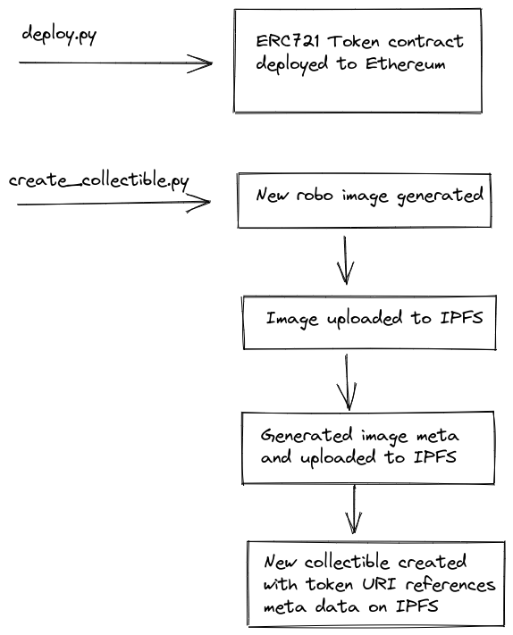

==================================================================================
# Create YOUR own NFT collection of lovely robots!

==================================================================================

## Collection example

https://testnets.opensea.io/collection/robohash

## How to use
> This project is based on [nft-mix](https://github.com/PatrickAlphaC/nft-mix) example. 
> Please check tools installation instructions there.

* Configure you own `.env` file
```
export PRIVATE_KEY=...
export WEB3_INFURA_PROJECT_ID=...
export ETHERSCAN_TOKEN=...
export PINATA_API_KEY=...
export PINATA_API_SECRET=...

```

* Run `brownie compile` to compile smart contract
* Run `brownie run scripts/deploy.py --network rinkeby` for contract deployment.
* Then run `brownie run scripts/create_collectible.py --network rinkeby` to generate, upload and create.
* **Proceed with link from output and check your NFT !**

## How it works
all the DeFi basics are explained in this amazing free [course](https://www.youtube.com/watch?v=M576WGiDBdQ)

Here is simple flow sketch:




----------------------------------------------------------------------------------
Thanks to [RoboHash](robohash.org) by providing this lovely robot generation service to humble developers.
